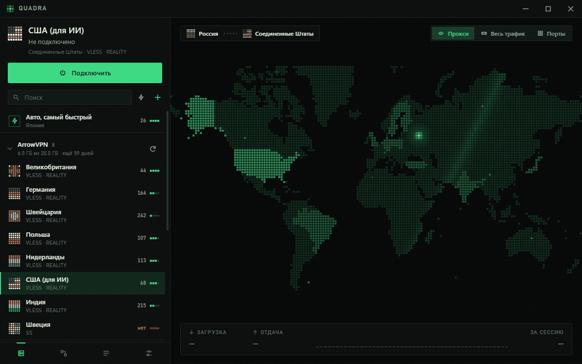
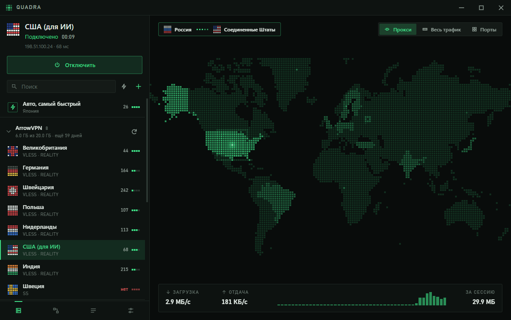
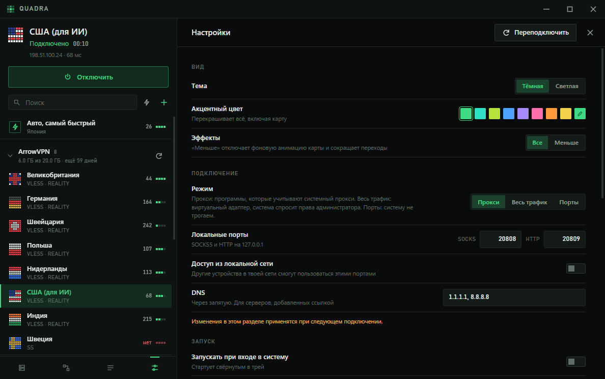
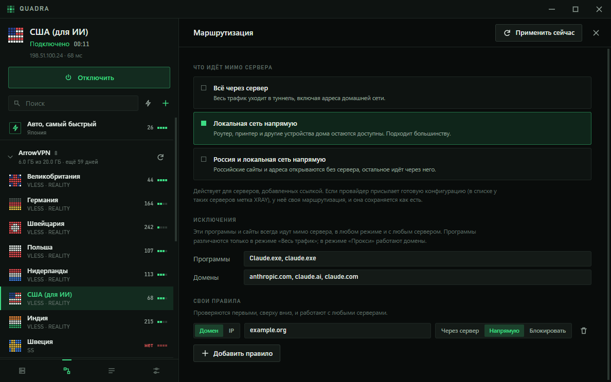
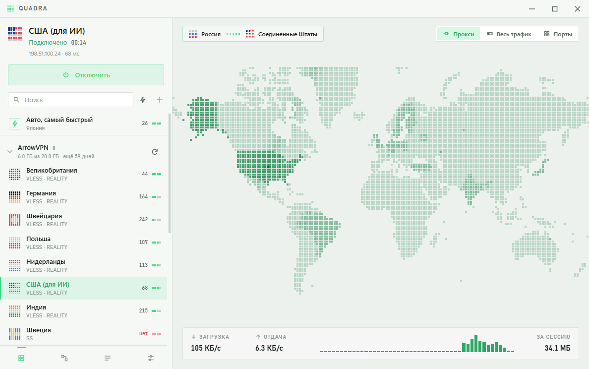

<p align="center">
  
</p>

<h1 align="center">Quadra</h1>

<p align="center">
  A desktop client for VLESS and the other Xray protocols.<br>
  Fast to open, fast to connect.
</p>

<p align="center">
  <a href="https://github.com/Omibranch/quadra/releases/latest"></a>
  <a href="https://github.com/Omibranch/quadra/actions/workflows/build.yml"></a>
  
  <a href="LICENSE"></a>
</p>

<p align="center">
  <a href="README.ru.md">Русская версия</a>
</p>

<p align="center">
  
</p>

## What it does

- **Subscriptions that actually load.** Many providers limit the number of devices and hand out
  servers only to a client that names the device it runs on. Quadra sends the device headers
  (`x-hwid` and friends), so those subscriptions return their full list instead of a
  "client not supported" stub. You can switch this off.
- **Share links and ready-made configs.** `vless://`, `vmess://`, `trojan://`, `ss://`, a base64
  list, or a complete Xray JSON config with balancers and its own routing: paste it, drop a
  file on the window, or just press Ctrl+V anywhere.
- **Three ways to connect.** System proxy, all traffic through a virtual adapter (TUN), or
  local SOCKS/HTTP ports only.
- **A map of the connection.** It shows where you are and where the server is. The status
  turns to "connected" only after a real request has gone through the tunnel.
- **Routing and exclusions.** Keep the home network or a whole country direct, add your own
  domain and address rules, and list programs and sites that must never go through the server.
- **Yours to restyle.** Dark and light themes and any accent colour; the whole interface,
  the map included, follows it.

Under the hood every connection is made by [Xray-core](https://github.com/XTLS/Xray-core),
so everything Xray speaks works here: REALITY, XHTTP, gRPC, WebSocket and the rest.

## Download

Get the installer for your system from the
[latest release](https://github.com/Omibranch/quadra/releases/latest).

| System | File | Notes |
|---|---|---|
| Windows 10/11 | `Quadra_x.y.z_x64-setup.exe` | Installs for the current user, no administrator rights needed |
| macOS, Apple silicon | `Quadra_x.y.z_aarch64.dmg` | See the note on unsigned builds below |
| macOS, Intel | `Quadra_x.y.z_x64.dmg` | |
| Linux | `.deb`, `.rpm` or `.AppImage` | Needs WebKitGTK 4.1 |

The builds are not code-signed. Windows SmartScreen will ask once ("More info", then
"Run anyway"). On macOS, open the app the first time with a right click and "Open", or run
`xattr -cr /Applications/Quadra.app`.

**State of the platforms.** Windows is where Quadra is developed and used every day. The macOS
and Linux versions are built and tested automatically but have not yet had much time on real
machines: treat them as a preview and [open an issue](https://github.com/Omibranch/quadra/issues)
when something is off.

The interface is in Russian for now.

## A closer look

| | |
|---|---|
|  |  |
| Connected: exit address, latency, live speed | Settings apply at once, there is no "save" |
|  |  |
| Routing presets, exclusions and your own rules | Light theme |

## Notes on the modes

- **All traffic (TUN)** needs elevated rights to create the adapter. On Windows the app
  restarts itself as administrator; on macOS and Linux only the core is started with rights,
  through the system's own password prompt (`pkexec` on Linux).
- Two tunnels cannot share one machine. If another VPN already holds the default route,
  Quadra says so instead of starting a second tunnel next to it.
- **System proxy** is set through the system's own mechanism: the Windows Internet settings,
  `networksetup` on macOS, GNOME or KDE settings on Linux. On desktops without such a setting
  use the ports or the all-traffic mode.
- **Tiling window managers** (sway, i3, Hyprland and others) are detected: the window drops its
  own title bar and startup splash, has no minimum size, and folds into a single column when the
  tile is narrow.

## Building from source

You need [Node.js](https://nodejs.org) 22 or newer, [Rust](https://rustup.rs) and the
[Tauri prerequisites](https://v2.tauri.app/start/prerequisites/) for your system.

```sh
npm install
node tools/fetch-xray.mjs     # downloads Xray-core for this machine and verifies its checksum
npm run tauri dev             # run it
npm run tauri build           # make the installer
```

`npm run dev` alone serves the interface in a browser against a stand-in backend with sample
data, which is the quickest way to work on the interface.

Where things are:

| Path | What |
|---|---|
| `src/` | The interface (Svelte 5). `lib/MapView.svelte` is the map and the connect animation, `app.css` holds every colour, size and speed as a variable |
| `src-tauri/src/` | The backend (Rust): subscriptions, share links, Xray config, the core's lifecycle |
| `src-tauri/src/sys/` | Everything that differs between operating systems |
| `tools/` | Scripts: the map generator, the startup cube (a Blender render), end-to-end checks |

Tests: `cargo test` in `src-tauri`.

## Credits

Quadra stands on [Xray-core](https://github.com/XTLS/Xray-core),
[Tauri](https://tauri.app) and [Svelte](https://svelte.dev). The map is drawn from
[Natural Earth](https://www.naturalearthdata.com) data. See [THIRD_PARTY.md](THIRD_PARTY.md).

## Licence

[MIT](LICENSE)
